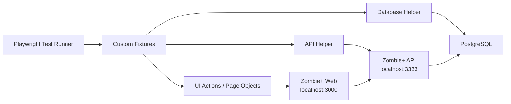

# 🧟 Zombie+ | Ecossistema Avançado de Automação E2E, API e Dados com Playwright

<div align="center">
  
  
  
  
  
  
</div>

<div align="center">
  <h3>🚀 Um laboratório de Engenharia de Qualidade ponta a ponta para validar fluxos críticos de uma plataforma de streaming</h3>
</div>

---

## ✨ Visão Geral

Este repositório reúne uma aplicação completa chamada **Zombie+** e um **framework de automação de testes** construído com foco em qualidade real de produto, manutenção de longo prazo e execução confiável em diferentes camadas do sistema.

O projeto foi estruturado para validar comportamentos de negócio de forma **end-to-end**, mas sem se limitar à interface. A estratégia combina:

- 🖥️ **UI Automation** com Playwright
- 🔌 **Preparação de cenários via API**
- 🗃️ **Manipulação de estado diretamente no banco**
- 🌐 **Execução cross-browser e mobile**
- 📹 **Coleta de evidências em falhas**
- 🤖 **Pipeline de CI com GitHub Actions**

Em vez de tratar automação como um simples conjunto de scripts, este repositório demonstra uma abordagem mais madura: **testes como produto de engenharia**, com arquitetura, reaproveitamento, previsibilidade e observabilidade.

---

## ⚡ Destaques em 30 segundos

| Item | Resumo |
| --- | --- |
| 🧪 Escopo atual | 22 cenários automatizados distribuídos entre login, leads, filmes e séries |
| 🌍 Matriz de execução | Chromium, Firefox, WebKit, Chrome, Edge, Mobile Chrome e Mobile Safari |
| 🧱 Arquitetura | Actions/Page Objects, fixtures customizadas, helper de API, helper de banco e massa de dados dedicada |
| 🗄️ Dados | Seed híbrido via SQL, API e fixtures JSON |
| 📹 Evidências | Trace, screenshot e vídeo em falhas |
| 🤖 CI | Execução automática em `push` e `pull_request` para `main` |
| 🧰 Stack | Playwright, Node.js, PostgreSQL, Docker, GitHub Actions |

---

## 🎯 Objetivo do Projeto

O foco deste repositório é demonstrar, de forma prática, como construir uma automação robusta para uma aplicação web real, indo além do clique por clique.

Aqui a automação é tratada como parte da estratégia de qualidade do produto, com atenção especial para:

- ✅ cobertura de cenários críticos de negócio;
- ✅ organização de código para escalar com novas suítes;
- ✅ redução de flakiness com setup controlado;
- ✅ separação de responsabilidades entre teste, ação, API e dados;
- ✅ execução reproduzível localmente e em integração contínua;
- ✅ geração de evidências úteis para investigação de falhas.

---

## 🧠 O Que Este Repositório Demonstra na Prática

Mais do que provar que os testes "rodam", este projeto evidencia competências importantes de engenharia:

- 🏗️ desenho de framework de testes orientado à manutenção;
- 🔍 entendimento de fluxo completo entre frontend, backend e banco;
- 🧪 modelagem de cenários positivos, negativos e de validação;
- ⚙️ uso de setup inteligente para acelerar a suíte;
- 📦 organização de massa de dados versionada;
- 🌐 execução em múltiplos navegadores e dispositivos;
- 🧾 padronização de evidências e rastreabilidade de falhas;
- 🚦 preparação para uso em pipeline de CI.

---

## 🏛️ Arquitetura do Ecossistema

O repositório contém tanto o **System Under Test (SUT)** quanto o **framework de automação**.



### 🧩 Como as camadas se conectam

- A automação interage com a aplicação web via navegador.
- A própria suíte também usa chamadas HTTP para montar cenários mais rapidamente.
- Quando necessário, o estado é ajustado diretamente no banco para garantir previsibilidade.
- O backend da aplicação consome o mesmo banco que a camada de suporte usa para preparar ou limpar dados.

Essa combinação reduz tempo de execução, evita setup desnecessário pela UI e aumenta a estabilidade da suíte.

---

## 🗂️ Estrutura do Repositório

```text
C:\QAx
├─ .github/
│  └─ workflows/
│     └─ playwright.yml
├─ apps/
│  └─ zombieplus/
│     ├─ api/
│     ├─ web/
│     └─ docker-compose.yml
├─ projects/
│  └─ zombieplus/
│     ├─ tests/
│     │  ├─ e2e/
│     │  └─ support/
│     ├─ playwright.config.js
│     ├─ package.json
│     └─ package-lock.json
└─ README.md
```

### 📁 Papel de cada área

| Caminho | Responsabilidade |
| --- | --- |
| `apps/zombieplus/api` | Backend REST da aplicação alvo |
| `apps/zombieplus/web` | Frontend da aplicação Zombie+ |
| `apps/zombieplus/docker-compose.yml` | Infra local para banco PostgreSQL e pgAdmin |
| `projects/zombieplus/tests/e2e` | Cenários de teste organizados por domínio |
| `projects/zombieplus/tests/support/actions` | Camada de abstração da UI |
| `projects/zombieplus/tests/support/api` | Helper para operações de API |
| `projects/zombieplus/tests/support/fixtures` | Massa de dados estruturada e arquivos de apoio |
| `projects/zombieplus/tests/support/database.js` | Execução de SQL direto para setup/cleanup |
| `projects/zombieplus/tests/support/index.js` | Fixtures customizadas de `page` e `request` |
| `.github/workflows/playwright.yml` | Execução automatizada no GitHub Actions |

---

## 🧪 Cobertura Atual da Automação

Atualmente a suíte cobre quatro áreas centrais do produto:

### 🔐 1. Login Administrativo

- login com credenciais válidas;
- tentativa com senha incorreta;
- tentativa com e-mail inválido;
- validação de e-mail obrigatório;
- validação de senha obrigatória;
- validação quando nenhum campo é preenchido.

### 📬 2. Leads / Fila de Espera

- cadastro de lead com sucesso;
- prevenção de duplicidade por e-mail;
- validação de formato de e-mail;
- validação de nome obrigatório;
- validação de e-mail obrigatório;
- validação quando nenhum campo é preenchido.

### 🎬 3. Catálogo de Filmes

- cadastro de novo filme;
- remoção de filme;
- bloqueio para título duplicado;
- validação de campos obrigatórios;
- busca por termo específico.

### 📺 4. Catálogo de Séries

- cadastro de nova série;
- remoção de série;
- bloqueio para título duplicado;
- validação de campos obrigatórios;
- busca por termo específico.

### 📌 Resumo do escopo atual

| Domínio | Quantidade de cenários |
| --- | --- |
| Login | 6 |
| Leads | 6 |
| Movies | 5 |
| TV Shows | 5 |
| **Total** | **22** |

---

## 🧱 Estratégia Técnica do Framework

### 🧩 1. Custom Fixtures para contexto de teste

O arquivo `projects/zombieplus/tests/support/index.js` estende o Playwright para entregar objetos de alto nível já prontos para uso:

- `page.login`
- `page.leads`
- `page.movies`
- `page.tvshows`
- `page.popup`
- `request.api`

Isso deixa os testes mais expressivos e focados na intenção do cenário, não em detalhes de implementação.

### 🖱️ 2. Camada de actions para desacoplar a UI

A pasta `tests/support/actions` concentra classes responsáveis por encapsular:

- navegação;
- preenchimento de formulários;
- buscas;
- exclusões;
- validações de alertas e popups.

Esse padrão reduz duplicação e facilita manutenção quando há mudança de seletor, texto ou fluxo.

### 🔌 3. Setup rápido via API

Em vários cenários, a suíte usa chamadas diretas para a API antes da interação de UI. Isso acelera a execução e evita que o teste desperdice tempo montando estado manualmente pela interface.

Exemplos:

- criação de filmes antes de validar remoção;
- criação de séries antes de validar busca;
- autenticação administrativa para operações auxiliares.

### 🗃️ 4. Controle de estado via banco de dados

O helper `tests/support/database.js` executa SQL diretamente no PostgreSQL para:

- limpar dados antes da execução;
- evitar conflito por duplicidade entre execuções;
- garantir previsibilidade e independência entre cenários.

Essa prática é especialmente útil quando a regra de negócio depende de unicidade ou quando o ambiente já contém dados residuais.

### 🎲 5. Massa de dados híbrida

O projeto combina diferentes estratégias de dados de teste:

- `faker` para dados dinâmicos em cenários de lead;
- arquivos JSON versionados para filmes e séries;
- imagens de capa armazenadas em fixtures;
- comandos SQL para cleanup determinístico.

Essa abordagem equilibra flexibilidade, reprodutibilidade e legibilidade.

### 📹 6. Observabilidade em falhas

A configuração do Playwright está preparada para reter evidências importantes:

- `trace: on-first-retry`
- `screenshot: only-on-failure`
- `video: retain-on-failure`

Isso melhora muito a investigação de problemas, principalmente em cenários intermitentes ou regressões recém-introduzidas.

### 🌍 7. Execução multi-browser e multi-device

O arquivo `playwright.config.js` já está preparado para rodar em:

- Chromium
- Firefox
- WebKit
- Mobile Chrome
- Mobile Safari
- Microsoft Edge
- Google Chrome

Na prática, isso amplia a confiança da suíte e valida a experiência em múltiplos contextos de uso.

### 🔐 8. Gestão de ambiente e configuração

O framework utiliza variáveis de ambiente para centralizar endpoints e credenciais técnicas. O carregamento foi estruturado para aceitar `.env` tanto:

- na raiz do repositório;
- quanto em `projects/zombieplus`.

Isso dá mais flexibilidade para diferentes estratégias de execução local e CI.

---

## 🧰 Stack Utilizada

### 🖥️ Automação

- Playwright
- JavaScript
- Node.js
- Faker
- Dotenv
- PostgreSQL Driver (`pg`)

### 🌐 Aplicação alvo

- Frontend servido com `serve`
- Backend Node.js com Express
- ORM Sequelize
- Banco PostgreSQL

### 🧪 Infra e suporte

- Docker
- pgAdmin
- GitHub Actions
- Tesults Reporter

---

## 🚀 Como Executar o Projeto Localmente

### 1. Suba a infraestrutura local

Na pasta da aplicação:

```bash
cd apps/zombieplus
docker-compose up -d
```

Isso disponibiliza:

- PostgreSQL em `localhost:5432`
- pgAdmin em `localhost:16543`

### 2. Inicie a API

```bash
cd apps/zombieplus/api
npm install
npm run dev
```

### 3. Inicie o frontend

```bash
cd apps/zombieplus/web
npm install
npm run dev
```

### 4. Configure o ambiente do framework de testes

Crie um arquivo `.env` na raiz do repositório ou em `projects/zombieplus`:

```env
BASE_URL=http://localhost:3000
BASE_API=http://localhost:3333
DB_HOST=localhost
DB_DATABASE=postgres
DB_USER=postgres
DB_PASSWORD=pwd123
DB_PORT=5432
TOKEN=
```

> `TOKEN` é opcional e só é necessário quando houver integração com o Tesults.

### 5. Instale o framework de testes

```bash
cd projects/zombieplus
npm install
npx playwright install
```

### 6. Execute a suíte

```bash
npx playwright test
```

### 7. Execute uma suíte específica

```bash
npx playwright test tests/e2e/login.spec.js
```

### 8. Execute um navegador específico

```bash
npx playwright test --project=chromium
```

### 9. Investigue um trace de falha

```bash
npx playwright show-trace test-results/<caminho-do-trace>.zip
```

---

## 🔐 Variáveis de Ambiente

| Variável | Finalidade |
| --- | --- |
| `BASE_URL` | URL base da aplicação web usada pela automação |
| `BASE_API` | URL base da API usada pelo helper HTTP |
| `DB_HOST` | Host do PostgreSQL utilizado no setup/cleanup dos testes |
| `DB_DATABASE` | Nome do banco de dados |
| `DB_USER` | Usuário do banco |
| `DB_PASSWORD` | Senha do banco |
| `DB_PORT` | Porta do banco |
| `TOKEN` | Token opcional para integração com Tesults |

> O banco apontado pelas variáveis `DB_*` deve ser o mesmo ambiente consumido pela API, para que o estado preparado pela suíte reflita corretamente na aplicação.

---

## 🤖 Integração Contínua

O workflow versionado em `.github/workflows/playwright.yml` executa automaticamente a estratégia de qualidade do projeto em `push` e `pull_request` para a branch `main`.

### O pipeline faz:

1. checkout do código;
2. setup do Node.js;
3. instalação das dependências da API, Web e automação;
4. subida da API;
5. subida do frontend;
6. instalação dos browsers do Playwright;
7. espera pelos serviços locais;
8. execução da suíte automatizada;
9. publicação de artefatos de execução.

Essa esteira mostra que o projeto não está restrito ao contexto da máquina local: ele foi pensado para funcionar em fluxo contínuo de validação.

---

## 📸 Evidências e Diagnóstico de Falhas

Quando um cenário falha, o framework preserva informações valiosas para análise:

- screenshot do estado visual;
- vídeo completo da execução;
- trace com timeline detalhada;
- logs e retorno do Playwright no terminal/CI.

Isso acelera o entendimento de regressões e evita depender apenas de reprodução manual.

---

## 🧪 Filosofia de Qualidade Aplicada

Este projeto foi construído com uma visão de QA moderna:

- testar comportamento de negócio, não apenas elementos visuais;
- usar a UI quando a UI é a camada certa para validar valor;
- usar API e banco quando o objetivo é ganhar velocidade e estabilidade;
- manter testes legíveis para que possam evoluir junto com o produto;
- tratar dados de teste, ambiente e observabilidade como parte da engenharia.

Em outras palavras: a proposta aqui não é "automatizar por automatizar", mas construir um **sistema de validação confiável**.

---

## 📚 Aprendizados e Maturidade Técnica Evidenciados

Ao navegar por este repositório, é possível identificar prática consistente em:

- modelagem de framework;
- organização por domínio funcional;
- abstração de interações complexas;
- setup de ambiente multi-serviço;
- integração entre UI, API e banco;
- parametrização por variáveis de ambiente;
- execução paralela e multiplataforma;
- observabilidade e investigação de falhas;
- versionamento de massa de dados;
- automação em pipeline.

---

## 🛣️ Roadmap de Evolução

Este repositório segue em expansão contínua. Os próximos passos naturais incluem:

- [ ] ampliar cobertura para cenários ainda mais críticos do catálogo;
- [ ] adicionar validações mais profundas de contrato e resposta da API;
- [ ] fortalecer estratégia de dados para ambientes efêmeros;
- [ ] expandir métricas e relatórios de execução;
- [ ] refinar scripts de execução para experiência ainda mais fluida;
- [ ] ampliar documentação técnica por módulo.

---

## 👨‍💻 Sobre Este Repositório

Este projeto representa um ambiente de prática avançada em **Engenharia de Qualidade**, com foco em automação moderna, arquitetura limpa de testes e integração real entre camadas.

Ele foi pensado para servir não só como suíte funcional, mas também como **portfólio técnico**, demonstrando clareza de estrutura, profundidade de abordagem e compromisso com qualidade de software em nível profissional.

---

## ⭐ Fechamento

Se a ideia é olhar para automação não como um conjunto de scripts frágeis, mas como uma disciplina de engenharia capaz de gerar confiança contínua em produto, este repositório foi construído exatamente nessa direção.

**Zombie+** é, ao mesmo tempo, um laboratório prático, um framework escalável e uma demonstração concreta de como qualidade pode ser tratada com profundidade técnica. 🧪🔥
